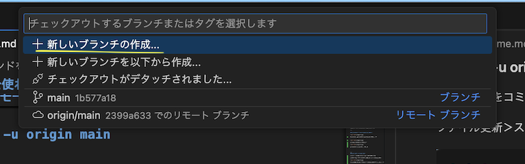

# git コマンドを使わずにvscodeでプルリクエストまで

gitのフローをVSCODEのみで一回り巡回できるようにするドキュメントです。

```bash
# gitの管理下であることを宣言
git init 

# 更新したファイルをステージングエリアに乗せる
git add

# ステージングエリアのファイルをコミットする
git commit -m "コメント"

# リモートにプッシュする
git push -u origin main

#新しいブランチを作成
git checkout -b 新しいブランチ
git switch -c 新しいブランチ

#ブランチの移動
git checkout ブランチ名
git switch ブランチ名


```


### git init


'リポジトリを初期化する'をクリックで終了。

---

### git add .


ここのプラスのボタンを押すと変更があったファイルがステージングエリアに登録されます。

---

### git commit -m (コミットメッセージ)


コミットメッセージを入力してコミットを押す。

---

### githubにリモートリポジトリを作成する


Branchの発行でリポジトリがgithub上に作成されます


プライベートとパブリックの選択


githubにコードがpushされました。


---
### git push -u origin main

上記の流れをコミットの単位で巡回していきます。

ファイル更新＞ステージング＞コミット＞リモートにプッシュ


以後はコミットが終わると、リモートにプッシュするボタンが出ます。

---

### git checkout -b 新しいブランチ
### git switch -c 新しいブランチ


vscode左下のこのボタンを押す。



新しいブランチに名前をつけて作成。


futureというブランチが作成され移動もしました。


以降はmainとfutureを移動できるようになります。
それぞれでcommitなどは別に管理されます。
futureでもリモートブランチを作成しておきます。


---

### プルリクエスト（分岐したブランチをmain,masterにマージする）

vscodeの拡張機能でgithub pull requestsをインストールする


上記拡張機能を入れるとこの場所にプルリクエストボタンが出ます。


プルリクエスト作成画面になります。


merge pull requestを押す


create merge commitを押す


コミット完成しました。ここでfutureブランチを消すこともできます。

---

### mainブランチに戻り、マージした差分をローカルにプルする


